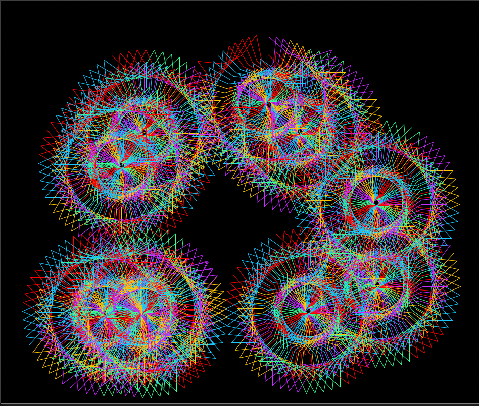

# Generative Spiral System


A Python program that creates dynamic, colorful spiral patterns using
the turtle graphics library.

## Overview

This project generates multiple spiral designs that are randomly
positioned on the screen. Each design adapts to the screen size and
remains fully visible, creating a layered, generative art effect.

## Features

- Randomized spiral placement across the screen  
- Automatically adapts to different screen sizes  
- Multiple spiral drawings displayed at once  
- Click anywhere to stop the program  
- Designed for use as a visual screensaver  

## Technologies Used

- Python  
- Turtle Graphics  

## How to Run

1. Make sure Python is installed  
2. Run the program:

```bash
python generative_spiral_system.py
```

## Technical Highlight

My goal was to make the program adapt to any screen size so the design
always stays fully visible and the experience is consistent for all users.

I didn’t know how to do that at first, so I used AI to help figure out
how to adjust the size of the drawing and limit where it could be placed
so it wouldn’t go off the screen.

I then tested it and made sure it worked correctly.

## What I Learned

- How to use loops and functions to generate patterns  
- How to manage multiple drawings on the screen  
- How to handle user interaction (click to exit)  
- How to adapt graphics to different screen sizes  

## Notes

Some parts of the program were developed with AI assistance to solve
specific challenges. I integrated and tested those solutions as part of
the final program.